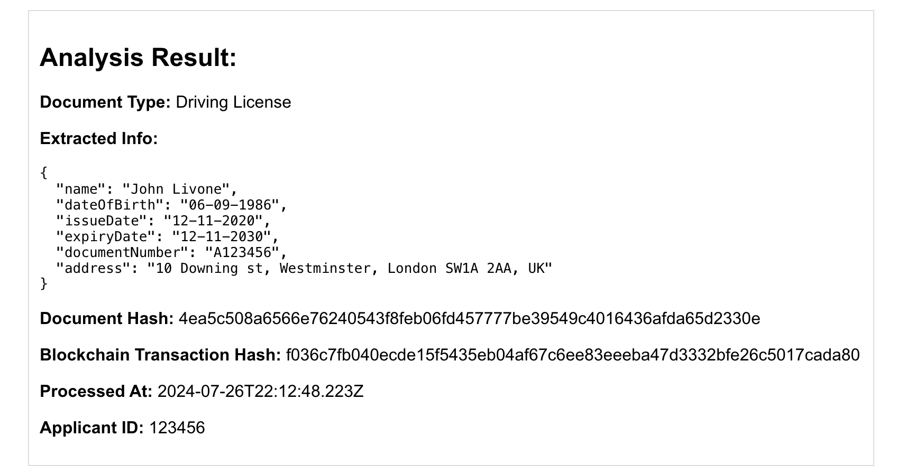
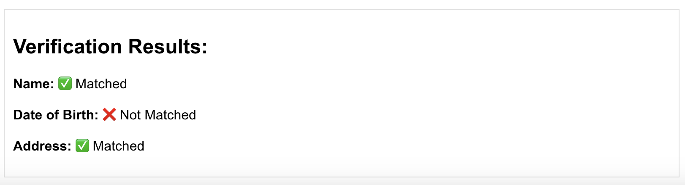

# Mortgage Document Processing POC

This project is a proof of concept for a mortgage document processing system using AI and blockchain technology.

## Architecture
+-----------------------------------+
|           Client (React)          |
|          (Port 3001)              |
+-------------------+---------------+
|                                   |
|              HTTP/AJAX            |
|                                   |
+-------------------v---------------+
|         Express.js Server         |
|          (Port 3500)              |
+-------------------+---------------+
            |           |
            |           |
+-------v---+ +-----v-----+ +---v---+
| MongoDB  | |  Ollama   | |  IPFS  |
| Database | |   (LLM)   | |(Future)|
+-----------+ +-----------+ +-------+

## Components

1. **Client (React) - Port 3001**
   - User Interface for document upload and verification
   - Communicates with the server via HTTP/AJAX calls

2. **Express.js Server - Port 5000**
   - Handles API requests from the client
   - Manages file uploads
   - Coordinates document processing and data storage
   - Interfaces with other services (MongoDB, Ollama, future IPFS)

3. **MongoDB Database**
   - Stores document metadata and extracted information
   - Persists user and application data

4. **Ollama (Local LLM)**
   - Processes uploaded documents
   - Extracts relevant information
   - Classifies document types

5. **IPFS (Future Implementation)**
   - Could be used for decentralized storage of documents

## Setup and Installation

1. Clone the repository:

```bash
git clone https://github.com/your-username/mortgage-poc.git
cd mortgage-poc
```
2. Install dependencies:

```bash
npm install
cd client && npm install
```
3. Set up environment variables:
Create a `.env` file in the root directory with the following content:

```bash
SERVER_PORT=5000
CLIENT_PORT=3001
MONGODB_URI=mongodb://localhost/mortgage_poc
```
4. Start the development server:

```bash
npm run dev
```

## Usage

1. Open a web browser and navigate to `http://localhost:3001`
2. Upload a document (supported formats: JPEG, PNG)
3. Enter applicant details
4. Submit the form
5. View the analysis results and verification status

## API Endpoints

- `POST /api/upload`: Upload and process a document

## Technologies Used

- Frontend: React.js
- Backend: Node.js, Express.js
- Database: MongoDB
- AI Processing: Ollama (Local LLM)
- OCR: Tesseract.js
- File Upload: Multer

## Future Enhancements

- Implement IPFS for decentralized document storage
- Add support for PDF document processing
- Enhance security features and implement user authentication
- Integrate with a production-ready blockchain solution

## Sample Output

Once you get a successful response, the document results will be shown below form like below.


The document verification results will be shown below form like below.


## Contributing

Please read [CONTRIBUTING.md](CONTRIBUTING.md) for details on our code of conduct and the process for submitting pull requests.

## License

This project is licensed under the MIT License